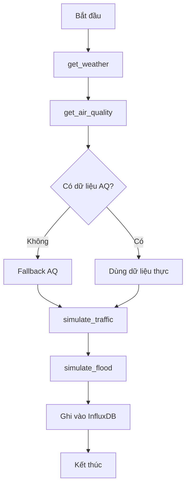

# Kịch bản Giả lập Dữ liệu IoT

## 📌 Giới thiệu

Module `iot_collector.py` được thiết kế để thu thập và mô phỏng dữ liệu từ các nguồn khác nhau, bao gồm thời tiết, chất lượng không khí, giao thông, tiếng ồn, và ngập lụt. Các giả lập được sử dụng để:

- Cung cấp dữ liệu thay thế khi không có dữ liệu thực tế
- Mô phỏng các điều kiện môi trường dựa trên các yếu tố đầu vào

---

## 📂 Cấu trúc các giả lập

### 1. Giả lập thời tiết

#### Hàm: `get_weather(lat: float, lon: float)`

**Mục đích:** Lấy dữ liệu thời tiết từ OpenWeatherMap API hoặc xử lý lỗi khi không có dữ liệu.

**Dữ liệu trả về:**

| Tham số | Đơn vị | Mô tả |
|---------|--------|-------|
| `temperature` | °C | Nhiệt độ không khí |
| `humidity` | % | Độ ẩm tương đối |
| `wind_speed` | m/s | Tốc độ gió |
| `rain_1h` | mm | Lượng mưa trong 1 giờ |

**Xử lý lỗi:**
- In ra thông báo khi thiếu API key hoặc lỗi kết nối

---

### 2. Giả lập chất lượng không khí

#### Hàm: `get_air_quality(lat: float, lon: float, radius: int = 25000)`

**Mục đích:** Lấy dữ liệu chất lượng không khí từ OpenAQ API hoặc mô phỏng dữ liệu khi không có dữ liệu thực tế.

**Dữ liệu trả về:**

| Tham số | Đơn vị | Mô tả |
|---------|--------|-------|
| `pm25` | µg/m³ | Hạt bụi mịn PM2.5 |
| `pm10` | µg/m³ | Hạt bụi thô PM10 |
| `aqi` | AQI | Chỉ số chất lượng không khí |

**Mô phỏng dữ liệu (Fallback):**
- PM2.5: Giá trị ngẫu nhiên từ 20-60 µg/m³
- PM10: Giá trị ngẫu nhiên từ 40-80 µg/m³
- AQI: Tính toán từ PM2.5 theo chuẩn Vietnam/US EPA

---

### 3. Giả lập lưu lượng giao thông

#### Hàm: `simulate_traffic_flow(current_hour: int, traffic_factor: float = 1.0)`

**Mục đích:** Mô phỏng cường độ giao thông và tốc độ trung bình dựa trên giờ trong ngày và đặc điểm địa điểm.

**Dữ liệu trả về:**

| Tham số | Đơn vị | Mô tả |
|---------|--------|-------|
| `intensity` | 0-100 | Cường độ giao thông |
| `avg_speed` | km/h | Tốc độ trung bình |

**Logic mô phỏng:**

| Khung giờ | Cường độ | Đặc điểm |
|-----------|----------|----------|
| **7-8h, 17-18h** | 70-80 | Giờ cao điểm (rush hour) |
| **9-16h** | 40-50 | Giờ làm việc |
| **19-22h** | 30-40 | Buổi tối |
| **23-5h** | 5-10 | Ban đêm |

**Công thức:**
```python
# Điều chỉnh với hệ số traffic_factor
final_intensity = int(base_intensity * traffic_factor)
final_intensity = min(100, final_intensity)

# Tốc độ trung bình
avg_speed = max(5, 60 - (intensity * 0.6))
```

---

### 4. Giả lập mức độ tiếng ồn

#### Hàm: `simulate_noise_level(traffic_intensity: int)`

**Mục đích:** Mô phỏng mức độ tiếng ồn dựa trên cường độ giao thông.

**Dữ liệu trả về:**

| Tham số | Đơn vị | Mô tả |
|---------|--------|-------|
| `noise_level` | dB | Mức độ tiếng ồn |

**Công thức tính toán:**

```python
# Tiếng ồn cơ bản
base_noise = 45.0  # dB

# Đóng góp từ giao thông
traffic_contribution = traffic_intensity * 0.4

# Dao động ngẫu nhiên
random_fluctuation = random.uniform(-2.0, 2.0)

# Tổng hợp
noise_level = base_noise + traffic_contribution + random_fluctuation
```

**Mức độ tiếng ồn theo cường độ giao thông:**

| Cường độ giao thông | Tiếng ồn dự kiến |
|---------------------|------------------|
| 0-20 | 45-53 dB (Yên tĩnh) |
| 21-50 | 54-65 dB (Trung bình) |
| 51-80 | 66-77 dB (Ồn ào) |
| 81-100 | 78-87 dB (Rất ồn) |

---

### 5. Giả lập ngập lụt

#### Hàm: `simulate_flood_depth(rain_1h: float, current_level: float, drainage_rate: float = 5.0)`

**Mục đích:** Mô phỏng độ sâu ngập lụt dựa trên lượng mưa, mực nước hiện tại và khả năng thoát nước.

**Dữ liệu trả về:**

| Tham số | Đơn vị | Mô tả |
|---------|--------|-------|
| `new_level` | cm | Mực nước ngập mới |

**Công thức tính toán:**

```python
# Nước vào từ mưa
water_in = rain_1h * 0.5  # 1mm mưa → 0.5cm nước

# Nước thoát
water_out = drainage_rate

# Mực nước mới
new_level = current_level + water_in - water_out
new_level = max(0.0, min(100.0, new_level))  # Giới hạn [0, 100] cm
```

**Ví dụ kịch bản:**

| Lượng mưa | Mực nước hiện tại | Tốc độ thoát | Mực nước mới |
|-----------|-------------------|--------------|--------------|
| 10 mm/h | 5 cm | 5 cm/h | 5 cm (không đổi) |
| 20 mm/h | 10 cm | 5 cm/h | 15 cm (+5 cm) |
| 50 mm/h | 30 cm | 5 cm/h | 50 cm (+20 cm) |

---

### 6. Giả lập tổng hợp giao thông

#### Hàm: `simulate_traffic(station_id: str, traffic_factor: float = 1.0)`

**Mục đích:** Mô phỏng dữ liệu giao thông tổng hợp cho một trạm quan trắc.

**Dữ liệu trả về:**

```python
{
    'station_id': str,
    'intensity': int,        # 0-100
    'avg_speed': float,      # km/h
    'noise_level': float,    # dB
    'timestamp': str         # ISO 8601
}
```

**Flow xử lý:**


---

### 7. Giả lập tổng hợp ngập lụt

#### Hàm: `simulate_flood(station_id: str, lat: float, lon: float, drainage_rate: float = 5.0)`

**Mục đích:** Mô phỏng dữ liệu ngập lụt tổng hợp cho một trạm quan trắc.

**Dữ liệu trả về:**

```python
{
    'station_id': str,
    'flood_depth': float,    # cm
    'timestamp': str         # ISO 8601
}
```

**Flow xử lý:**


---

## 🌐 API và cấu hình

### OpenWeatherMap API

```yaml
URL: https://api.openweathermap.org/data/2.5/weather
Method: GET
Parameters:
  - lat: float (Vĩ độ)
  - lon: float (Kinh độ)
  - appid: string (API Key)
  - units: metric
```

**Biến môi trường:**
```bash
OPENWEATHER_API_KEY=your_api_key_here
```

### OpenAQ API

```yaml
URL: https://api.openaq.org/v3/locations
Method: GET
Parameters:
  - coordinates: lat,lon
  - radius: int (mét)
  - limit: int
Headers:
  - X-API-Key: string
```

**Biến môi trường:**
```bash
OPENAQ_API_KEY=your_api_key_here
```

---

## 📜 Thuật toán chi tiết

### 1. Giả lập chất lượng không khí (Fallback)

**Khi nào sử dụng:**
- OpenAQ API không trả về dữ liệu
- Không có trạm quan trắc trong bán kính yêu cầu

**Thuật toán:**

```python
def simulate_air_quality():
    # Bước 1: Sinh PM2.5
    pm25 = random.uniform(20, 60)
    
    # Bước 2: Sinh PM10
    pm10 = random.uniform(40, 80)
    
    # Bước 3: Tính AQI từ PM2.5
    aqi = calculate_vn_aqi(pm25)
    
    # Bước 4: Trả về
    return {
        'pm25': round(pm25, 1),
        'pm10': round(pm10, 1),
        'aqi': aqi
    }
```

**Hàm tính AQI Vietnam:**

| PM2.5 (µg/m³) | AQI | Mức độ |
|---------------|-----|--------|
| 0-15 | 0-50 | Tốt |
| 16-35 | 51-100 | Trung bình |
| 36-55 | 101-150 | Kém |
| 56-150 | 151-200 | Xấu |
| 151-250 | 201-300 | Rất xấu |
| 251+ | 301-500 | Nguy hại |

---

### 2. Giả lập lưu lượng giao thông

**Bước 1: Xác định cường độ cơ bản**

```python
def get_base_intensity(hour):
    if hour in [7, 8, 17, 18]:
        return random.randint(70, 80)  # Cao điểm
    elif 9 <= hour <= 16:
        return random.randint(40, 50)  # Làm việc
    elif 19 <= hour <= 22:
        return random.randint(30, 40)  # Tối
    else:
        return random.randint(5, 10)   # Đêm
```

**Bước 2: Điều chỉnh với traffic_factor**

```python
final_intensity = int(base_intensity * traffic_factor)
final_intensity = min(100, final_intensity)
```

**Bước 3: Tính tốc độ**

```python
avg_speed = max(5, 60 - (final_intensity * 0.6))
```

**Ví dụ:**

| Giờ | Base Intensity | Traffic Factor | Final Intensity | Avg Speed |
|-----|----------------|----------------|-----------------|-----------|
| 8h | 75 | 1.0 | 75 | 15 km/h |
| 8h | 75 | 1.2 | 90 | 6 km/h |
| 14h | 45 | 0.8 | 36 | 38 km/h |
| 2h | 7 | 1.0 | 7 | 56 km/h |

---

### 3. Giả lập mức độ tiếng ồn

**Công thức:**

```python
noise_level = 45.0 + (traffic_intensity * 0.4) + random.uniform(-2, 2)
```

**Thành phần:**
1. **Base noise (45 dB)**: Tiếng ồn môi trường cơ bản
2. **Traffic contribution**: 0.4 dB cho mỗi đơn vị cường độ
3. **Random fluctuation**: ±2 dB mô phỏng biến động tức thời

**Ví dụ:**

```python
# Cường độ giao thông = 80
noise = 45.0 + (80 * 0.4) + 1.5
noise = 45.0 + 32.0 + 1.5 = 78.5 dB
```

---

### 4. Giả lập ngập lụt

**Các thành phần:**

1. **Nước vào (water_in):**
   ```python
   water_in = rain_1h * 0.5  # mm → cm
   ```

2. **Nước thoát (water_out):**
   ```python
   water_out = drainage_rate  # cm/h
   ```

3. **Mực nước mới:**
   ```python
   new_level = current_level + water_in - water_out
   new_level = max(0.0, min(100.0, new_level))
   ```

**Ví dụ kịch bản mưa lớn:**

```python
# Tình huống: Mưa liên tục 3 giờ
t0: rain=10mm/h, level=0cm   → level=5cm   (5-5=0, +5)
t1: rain=20mm/h, level=5cm   → level=15cm  (10-5=5, +5)
t2: rain=30mm/h, level=15cm  → level=25cm  (15-5=10, +15)
t3: rain=0mm/h,  level=25cm  → level=20cm  (0-5=-5, +25)
```

---

## 🔄 Workflow tổng hợp

### Thu thập dữ liệu cho một trạm



---

## ⚙️ Tham số cấu hình

### Traffic Factor

Dùng để điều chỉnh cường độ giao thông theo đặc điểm địa điểm:

| Loại địa điểm | Traffic Factor | Mô tả |
|---------------|----------------|-------|
| Khu dân cư | 0.7 | Ít xe cộ |
| Đường phụ | 0.9 | Giao thông vừa |
| Đường chính | 1.0 | Tiêu chuẩn |
| Trục đường lớn | 1.2 | Đông đúc |
| Nút giao thông | 1.5 | Rất đông |

### Drainage Rate

Tốc độ thoát nước theo đặc điểm địa hình:

| Loại khu vực | Drainage Rate (cm/h) | Mô tả |
|--------------|----------------------|-------|
| Khu cao, thoát tốt | 10.0 | Nhanh |
| Bình thường | 5.0 | Trung bình |
| Khu trũng | 2.0 | Chậm |
| Trũng sâu, kém thoát | 1.0 | Rất chậm |

---

## 📊 Ví dụ dữ liệu đầu ra

### Traffic Data

```json
{
  "station_id": "traffic_HoanKiem_001",
  "intensity": 78,
  "avg_speed": 13.2,
  "noise_level": 76.8,
  "timestamp": "2025-12-10T08:30:00Z"
}
```

### Flood Data

```json
{
  "station_id": "flood_DinhCong_001",
  "flood_depth": 18.5,
  "timestamp": "2025-12-10T08:30:00Z"
}
```

