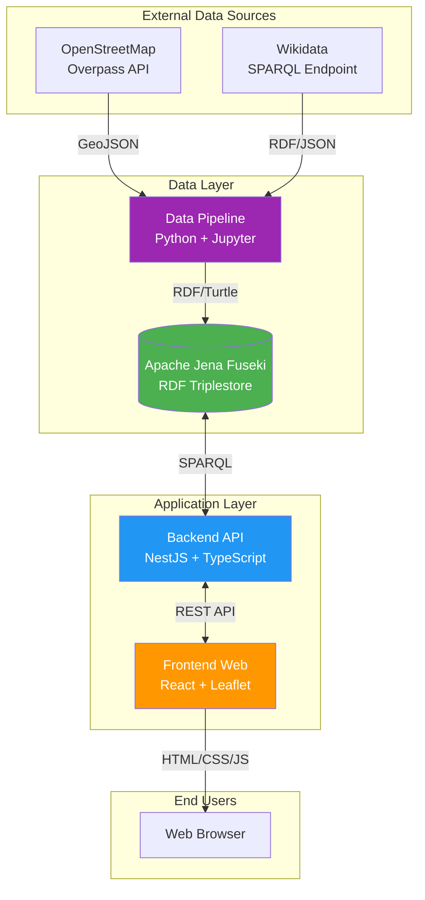
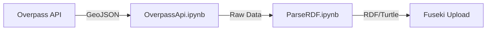
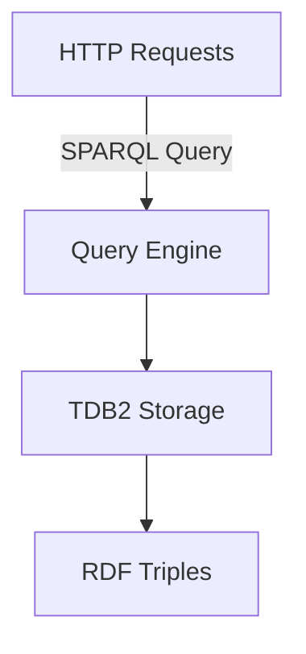
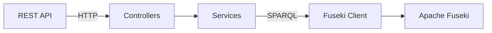
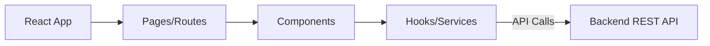
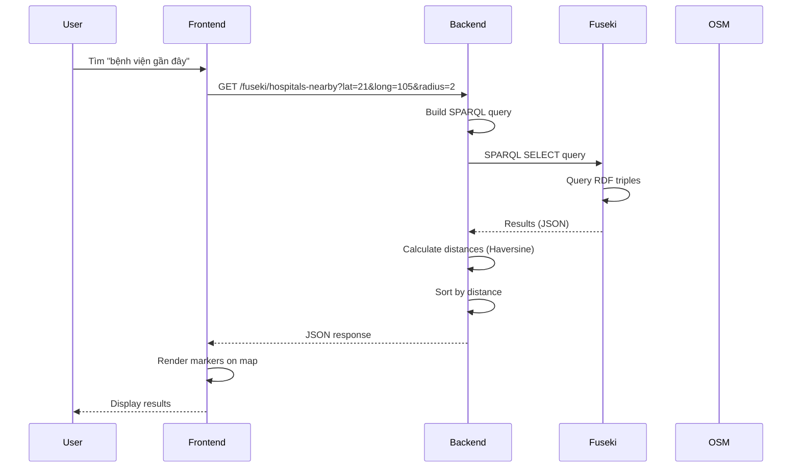
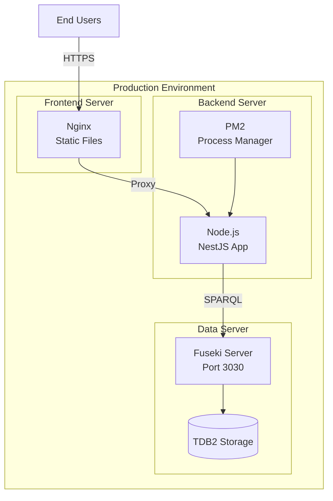

# Tổng quan Kiến trúc Hệ thống

## System Architecture

MFitHou sử dụng kiến trúc **3-tier** với Linked Open Data principles.

## Component Overview

### 1. Data Pipeline (OpenDataFitHou)
**Repository:** [OpenDataFitHou](https://github.com/MFitHou/OpenDataFitHou)

**Tech Stack:**
- Python 3.9+
- Jupyter Notebook
- RDFLib 7.1.1
- Requests 2.32.3

### 2. RDF Triplestore (Fuseki)
**Server:** Apache Jena Fuseki 5.x

**Features:**
- SPARQL 1.1 endpoint
- TDB2 persistent storage
- RDFS inference
- Web UI admin

### 3. Backend API (open_data_backend)
**Repository:** [open_data_backend](https://github.com/MFitHou/open_data_backend)

**Tech Stack:**
- NestJS 11
- TypeScript 5.7
- Axios HTTP client
- Node.js 18+

### 4. Frontend Web (open_data_map)
**Repository:** [open_data_map](https://github.com/MFitHou/open_data_map)

**Tech Stack:**
- React 19.1.1
- TypeScript 5.8.3
- Vite 7.1.7
- Leaflet 1.9.4
- Material-UI 6

## Data Flow

## Deployment Architecture

---

Xem chi tiết:
- [Component Diagram](component-diagram.md)
- [Data Flow](data-flow.md)
- [Technology Stack](technology-stack.md)
