# Tổng quan Kiến trúc Hệ thống

## System Architecture

MFitHou sử dụng kiến trúc **3-tier** với Linked Open Data principles.

## Component Overview

### 1. Data Pipeline (OpenDataFitHou)
**Repository:** [OpenDataFitHou](https://github.com/MFitHou/OpenDataFitHou)

```mermaid
flowchart LR
    %% Data Sources
    OSM[("🌍 OpenStreetMap")]
    Wikidata[("📚 Wikidata")]
    Weather[("🌤️ OpenWeather API")]
    AirQuality[("💨 OpenAQ API")]
    IoTSim[("📡 IoT Simulation")]
    
    %% Processing
    Fetch["📥 Fetch Data<br/>(Python Scripts)"]
    IoTCollector["🤖 IoT Collector<br/>(iot_collector.py)"]
    Process["⚙️ Process & Convert<br/>(GeoJSON → RDF)"]
    
    %% Storage
    Files[("📁 Data Files<br/>.geojson / .ttl")]
    Fuseki[("🗄️ Fuseki<br/>SPARQL DB")]
    InfluxDB[("⏱️ InfluxDB<br/>Time-series")]
    
    %% Backend
    API["🔌 NestJS API"]
    
    %% Frontend
    Web["🗺️ React Map"]
    
    %% User
    User((👤 User))
    
    %% Static Data Flow
    OSM --> Fetch
    Wikidata --> Fetch
    Fetch --> Process
    Process --> Files
    Files --> Fuseki
    
    %% Real-time Data Flow
    Weather --> IoTCollector
    AirQuality --> IoTCollector
    IoTSim --> IoTCollector
    IoTCollector --> InfluxDB
    
    %% API Integration
    Fuseki <--> API
    InfluxDB <--> API
    API <--> Web
    Web <--> User
    
    %% Styling
    classDef source fill:#e3f2fd,stroke:#1976d2
    classDef realtime fill:#fce4ec,stroke:#c2185b
    classDef process fill:#f3e5f5,stroke:#7b1fa2
    classDef storage fill:#fff3e0,stroke:#f57c00
    classDef service fill:#e8f5e9,stroke:#388e3c
    
    class OSM,Wikidata source
    class Weather,AirQuality,IoTSim realtime
    class Fetch,Process,IoTCollector process
    class Files,Fuseki,InfluxDB storage
    class API,Web service
```

**Tech Stack:**

- Python 3.9+
- Jupyter Notebook
- RDFLib 7.1.1
- Requests 2.32.3

### 2. Backend API (open_data_backend)
**Repository:** [open_data_backend](https://github.com/MFitHou/open_data_backend)

**Tech Stack:**

- NestJS 11
- TypeScript 5.7
- Node.js 18+

### 4. Frontend Web (open_data_map)
**Repository:** [open_data_map](https://github.com/MFitHou/open_data_map)

**Tech Stack:**

- React 19.1.1
- TypeScript 5.8.3
- Vite 7.1.7
- Leaflet 1.9.4

## 5. Data Flow

```mermaid
sequenceDiagram
    participant User
    participant Frontend
    participant Backend
    participant Triplestore

    User->>Frontend: Tìm "bệnh viện gần đây"
    Frontend->>Backend: GET /fuseki/hospitals-nearby
    Backend->>Backend: Build SPARQL query
    Backend->>Triplestore: SPARQL SELECT query
    Triplestore->>Triplestore: Query RDF triples
    Triplestore-->>Backend: Results (JSON)
    Backend->>Backend: Calculate distances (Haversine)
    Backend->>Backend: Sort by distance
    Backend-->>Frontend: JSON response
    Frontend->>Frontend: Render markers on map
    Frontend-->>User: Display results
```

