# Bắt đầu với MFitHou

Chào mừng đến với hướng dẫn bắt đầu sử dụng hệ sinh thái MFitHou!

## Tổng quan

MFitHou là hệ thống **Linked Open Data** phục vụ nghiên cứu và chuyển đổi số, bao gồm:

- 🐍 **Data Pipeline** - Thu thập & chuyển đổi dữ liệu OSM → RDF
- ⚡ **Backend API** - NestJS REST API với Fuseki integration
- 🗺️ **Frontend Web** - React interactive map application
- 📊 **RDF Triplestore** - Apache Jena Fuseki server

## Nội dung

-   :material-book-open-variant:{ .lg .middle } __Giới thiệu__

    ---

    Tìm hiểu về dự án MFitHou và mục tiêu

    [:octicons-arrow-right-24: Giới thiệu](introduction.md)

-   :material-star-circle:{ .lg .middle } __Tính năng__

    ---

    Khám phá các tính năng chính của hệ thống

    [:octicons-arrow-right-24: Tính năng](features.md)

-   :material-rocket-launch:{ .lg .middle } __Quick Start__

    ---

    Cài đặt và chạy toàn bộ hệ thống

    [:octicons-arrow-right-24: Quick Start](quick-start.md)

-   :material-server:{ .lg .middle } __Yêu cầu hệ thống__

    ---

    Hardware, software requirements

    [:octicons-arrow-right-24: Requirements](system-requirements.md)

-   :material-chart-timeline:{ .lg .middle } __Kiến trúc__

    ---

    Tổng quan kiến trúc hệ thống

    [:octicons-arrow-right-24: Architecture](architecture-overview.md)

## Learning Path

Chúng tôi khuyến nghị theo lộ trình học tập sau:

```mermaid
graph LR
    A[Giới thiệu] --> B[Tính năng]
    B --> C[Yêu cầu hệ thống]
    C --> D[Quick Start]
    D --> E[Kiến trúc]
    E --> F[User Guide]
    F --> G[Developer Guide]
```

1. **Đọc [Giới thiệu](introduction.md)** - Hiểu về dự án
2. **Xem [Tính năng](features.md)** - Biết hệ thống có gì
3. **Kiểm tra [Yêu cầu](system-requirements.md)** - Chuẩn bị môi trường
4. **Làm theo [Quick Start](quick-start.md)** - Chạy thử
5. **Tìm hiểu [Kiến trúc](architecture-overview.md)** - Hiểu cách hoạt động

## Next Steps

Sau khi hoàn thành phần Getting Started:

- 👤 **End Users**: Xem [User Guide](../user-guide/index.md)
- 👨‍💻 **Developers**: Xem [Developer Guide](../developer-guide/index.md)
- 🔌 **API Integration**: Xem [API Reference](../api-reference/index.md)
- 📊 **Data Scientists**: Xem [Data & RDF](../data-rdf/index.md)

---

!!! tip "Cần hỗ trợ?"
    Kiểm tra [FAQ](../faq.md) hoặc [Support](../support.md)
