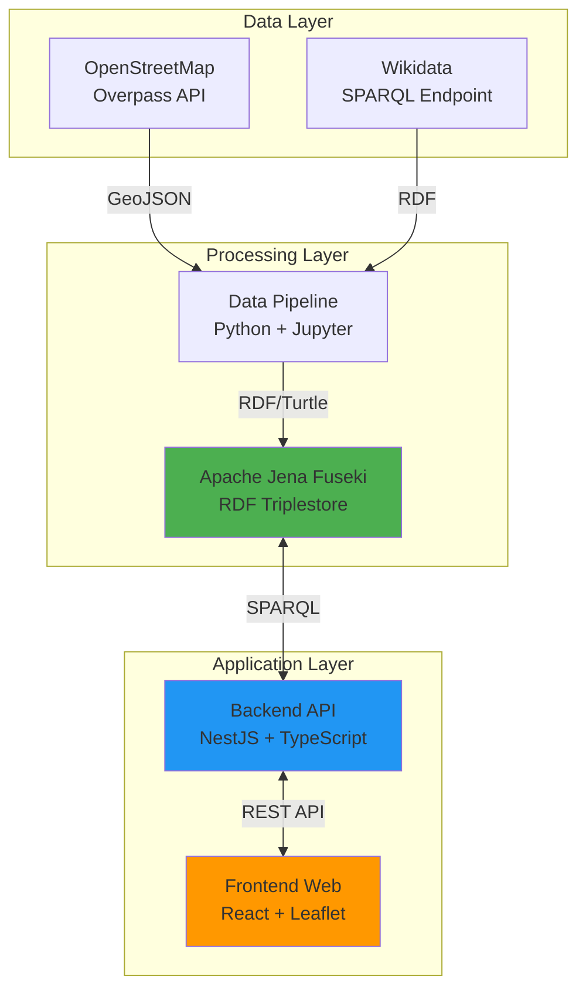
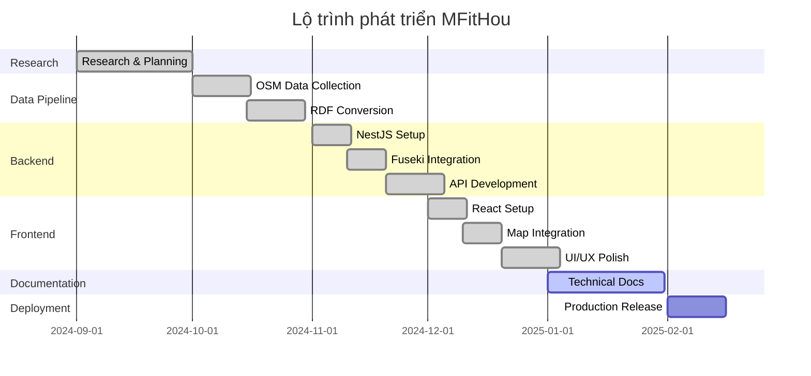

# Giới thiệu về MFitHou

## MFitHou là gì?

**MFitHou** (Mở FitHou) là hệ sinh thái **Linked Open Data (LOD)** phục vụ nghiên cứu và chuyển đổi số, được phát triển cho cuộc thi **Phần mềm Nguồn mở - Olympic Tin học sinh viên (OLP) 2025**.

Hệ thống cung cấp nền tảng dữ liệu mở liên kết về các điểm quan tâm (POI - Points of Interest) tại Việt Nam, tuân thủ chuẩn **W3C Semantic Web** (RDF, SPARQL, Linked Data).

## Mục tiêu dự án

### 1. Chuyển đổi số dữ liệu địa lý

Chuyển đổi dữ liệu địa lý từ **OpenStreetMap** sang định dạng **RDF/Turtle**, tạo nền tảng dữ liệu mở liên kết có thể:

- ✅ Truy vấn bằng SPARQL
- ✅ Liên kết với Wikidata, DBpedia
- ✅ Tích hợp với Semantic Web ecosystem

### 2. Cung cấp REST API

Xây dựng **RESTful API** với **NestJS** để:

- ✅ Tìm kiếm POI lân cận (ATMs, hospitals, toilets, etc.)
- ✅ Tích hợp Apache Jena Fuseki triplestore
- ✅ Hỗ trợ custom SPARQL queries

### 3. Interactive Web Application

Phát triển **React web app** với:

- ✅ Interactive Leaflet map
- ✅ POI search & nearby services
- ✅ AI chatbot (Google Gemini)
- ✅ Data export (XML, RDF, JSON)

### 4. Phần mềm nguồn mở

Tuân thủ tinh thần **Open Source**:

- ✅ GNU GPL v3.0 license
- ✅ Public GitHub repositories
- ✅ Comprehensive documentation
- ✅ Community contributions welcome

## Đặt vấn đề

### Thách thức với dữ liệu địa lý

**OpenStreetMap** cung cấp dữ liệu địa lý phong phú nhưng:

❌ Định dạng GeoJSON không tối ưu cho semantic search  
❌ Khó liên kết với knowledge graphs khác  
❌ Không hỗ trợ truy vấn SPARQL  
❌ Thiếu standardization cho POI schema  

### Nhu cầu Linked Open Data

Semantic Web cần:

✅ **Standardized schema** - Ontology rõ ràng  
✅ **Linked Data** - Liên kết với Wikidata, DBpedia  
✅ **SPARQL endpoint** - Query language mạnh mẽ  
✅ **RESTful API** - Dễ tích hợp với ứng dụng  

## Giải pháp

MFitHou giải quyết bằng kiến trúc **3-tier**:

### Data Pipeline (Python)

- Thu thập dữ liệu từ OSM Overpass API
- Chuyển đổi GeoJSON → RDF/Turtle
- Upload lên Apache Jena Fuseki

### Backend API (NestJS)

- REST API endpoints cho nearby search
- SPARQL integration với Fuseki
- CORS support cho frontend

### Frontend Web (React)

- Interactive Leaflet map
- Search locations (OSM + Wikidata)
- Nearby services visualization
- AI chatbot support

## Tech Stack

=== "Data Pipeline"
    | Technology | Version | Purpose |
    |------------|---------|---------|
    | Python | 3.9+ | Core language |
    | Jupyter | Latest | Interactive notebooks |
    | RDFLib | 7.1.1 | RDF processing |
    | Requests | 2.32.3 | HTTP requests |

=== "Backend"
    | Technology | Version | Purpose |
    |------------|---------|---------|
    | NestJS | 11.0.8 | Framework |
    | TypeScript | 5.7.2 | Language |
    | Node.js | 18+ | Runtime |
    | Axios | 1.7.9 | HTTP client |

=== "Frontend"
    | Technology | Version | Purpose |
    |------------|---------|---------|
    | React | 19.1.1 | UI framework |
    | TypeScript | 5.8.3 | Language |
    | Vite | 7.1.7 | Build tool |
    | Leaflet | 1.9.4 | Map library |
    | MUI | 6.3.0 | UI components |

=== "Infrastructure"
    | Technology | Version | Purpose |
    |------------|---------|---------|
    | Apache Jena Fuseki | 5.x | Triplestore |
    | Git | Latest | Version control |
    | GitHub Actions | Latest | CI/CD |
    | MkDocs Material | Latest | Documentation |

## Timeline

## Team

| Role | Responsibilities |
|------|------------------|
| **Project Lead** | Overall coordination, architecture design |
| **Backend Developer** | NestJS API, Fuseki integration |
| **Frontend Developer** | React app, Leaflet map, UI/UX |
| **Data Engineer** | Data pipeline, RDF conversion, SPARQL |

## License

**GNU General Public License v3.0**

- ✅ Commercial use
- ✅ Modification
- ✅ Distribution
- ✅ Patent use
- ❗ Disclose source
- ❗ License and copyright notice
- ❗ State changes
- ❗ Same license

Xem chi tiết: [LICENSE](../policies/license.md)

---

!!! success "Next Steps"
    Tiếp tục với [Tính năng chính](features.md) →
