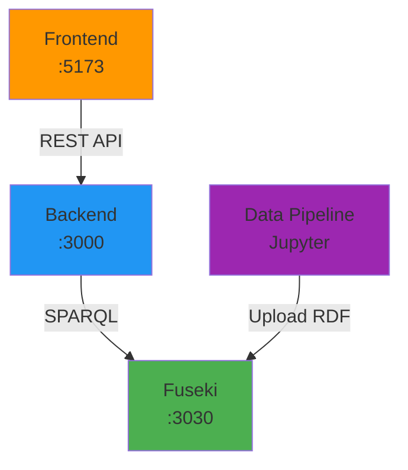

# Quick Start Guide

Hướng dẫn cài đặt và chạy toàn bộ hệ thống MFitHou trong **10 phút**.

## Prerequisites

Kiểm tra đã cài đặt:

```powershell
# Node.js (>= 18.0)
node --version

# Python (>= 3.9)
python --version

# Git
git --version
```

## Step 1: Clone Repositories

```powershell
# Tạo thư mục workspace
mkdir MFitHou
cd MFitHou

# Clone tất cả repositories
git clone https://github.com/MFitHou/OpenDataFitHou.git
git clone https://github.com/MFitHou/open_data_backend.git
git clone https://github.com/MFitHou/open_data_map.git
```

## Step 2: Setup Apache Jena Fuseki

### Download Fuseki

```powershell
# Download từ Apache
https://dlcdn.apache.org/jena/binaries/apache-jena-fuseki-5.2.0.zip

# Giải nén
Expand-Archive apache-jena-fuseki-5.2.0.zip -DestinationPath ./fuseki
```

### Start Fuseki Server

```powershell
cd fuseki/apache-jena-fuseki-5.2.0
./fuseki-server.bat --port=3030
```

Truy cập: `http://localhost:3030`

### Create Dataset

1. Mở Fuseki UI: `http://localhost:3030`
2. Click **"Manage datasets"**
3. Click **"Add new dataset"**
4. Dataset name: `mfithou`
5. Dataset type: **Persistent (TDB2)**
6. Click **"Create dataset"**

## Step 3: Run Data Pipeline

```powershell
cd OpenDataFitHou

# Create virtual environment
python -m venv venv

# Activate venv
.\venv\Scripts\activate  # Windows
# source venv/bin/activate  # macOS/Linux

# Install dependencies
pip install -r requirements.txt

# Start Jupyter
jupyter notebook
```

**Run notebooks:**

1. Mở `OverpassApi.ipynb` → Run all cells (thu thập dữ liệu OSM)
2. Mở `ParseRDF.ipynb` → Run all cells (chuyển đổi sang RDF)
3. Upload `.ttl` files lên Fuseki qua UI

## Step 4: Run Backend API

```powershell
cd open_data_backend

# Install dependencies
npm install

# Create .env file
@"
FUSEKI_SERVER_URL=http://103.77.246.176:3030
FUSEKI_DATASET=mfithou
PORT=3000
"@ | Out-File -FilePath .env -Encoding utf8

# Run development server
npm run start:dev
```

API sẽ chạy tại: `http://localhost:3000`

### Test API

```powershell
# Health check
curl http://localhost:3000/fuseki/hello

# Nearby ATMs
curl "http://localhost:3000/fuseki/atms-nearby?lat=21.0285&long=105.8542&radiusKm=2&limit=10"
```

## Step 5: Run Frontend Web

```powershell
cd open_data_map

# Install dependencies
npm install

# Create .env file
@"
VITE_BACKEND_URL=http://localhost:3000
VITE_GEMINI_API_KEY=your_api_key_here
"@ | Out-File -FilePath .env -Encoding utf8

# Run development server
npm run dev
```

Frontend sẽ chạy tại: `http://localhost:5173`

## Step 6: Test Full System

### 1. Mở Frontend

Truy cập: `http://localhost:5173`

### 2. Test Search

- Click vào ô search
- Gõ "Hà Nội"
- Chọn kết quả từ dropdown

### 3. Test Nearby Services

- Click các icon:
  - 🏧 ATMs
  - 🏥 Hospitals
  - 🚻 Toilets
  - 🚌 Bus Stops
  - 🎪 Playgrounds

### 4. Test Chatbot

- Click icon chat
- Hỏi: "Tìm bệnh viện gần đây"

### 5. Test Export

- Click **"Export Data"**
- Chọn format: XML, RDF, hoặc JSON
- Download file

## Quick Start (Docker) - Coming Soon

```powershell
# Clone repo
git clone https://github.com/MFitHou/mfithou-docker.git
cd mfithou-docker

# Start all services
docker-compose up -d

# Services:
# - Fuseki: http://localhost:3030
# - Backend: http://localhost:3000
# - Frontend: http://localhost:5173
```

## Troubleshooting

### Backend không connect được Fuseki

```powershell
# Kiểm tra Fuseki đang chạy
curl http://localhost:3030/$/ping

# Kiểm tra dataset exists
curl http://localhost:3030/$/datasets
```

### Frontend không gọi được Backend

```powershell
# Kiểm tra CORS settings trong backend/src/main.ts
app.enableCors({
  origin: 'http://localhost:5173',
  credentials: true,
});
```

### Python dependencies lỗi

```powershell
# Upgrade pip
python -m pip install --upgrade pip

# Reinstall dependencies
pip install -r requirements.txt --force-reinstall
```

## Architecture Overview



## Next Steps

Sau khi chạy thành công:

- 📖 Đọc [User Guide](../user-guide/index.md) - Hướng dẫn sử dụng
- 👨‍💻 Đọc [Developer Guide](../developer-guide/index.md) - Phát triển
- 🔌 Xem [API Reference](../api-reference/index.md) - Tài liệu API
- 📊 Xem [Data & RDF](../data-rdf/index.md) - Cấu trúc dữ liệu

---

!!! success "Chúc mừng!"
    Bạn đã chạy thành công hệ thống MFitHou! 🎉
