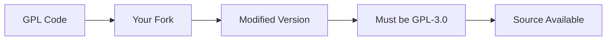

# Giấy phép Mã nguồn - GNU GPL v3.0

## Tổng quan

Toàn bộ mã nguồn của dự án **OpenDataMap** được phát hành theo **GNU General Public License phiên bản 3.0 (GPL-3.0)**. Đây là giấy phép phần mềm tự do, copyleft đảm bảo quyền tự do chia sẻ và thay đổi phần mềm.

## Các thành phần áp dụng GPL-3.0

| Thành phần | Repository | Mô tả |
|------------|------------|-------|
| **Data Pipeline** | OpenDataFitHou | Python notebooks, RDF generation |
| **Backend API** | open_data_backend | NestJS REST API, SPARQL integration |
| **Frontend Web** | open_data_map | React app, Leaflet map |
| **Documentation** | MFitHou-Documents | MkDocs documentation site |

## Quyền lợi của bạn

Với GPL-3.0, bạn có đầy đủ các quyền sau:

### ✅ Tự do sử dụng

- Chạy phần mềm cho **bất kỳ mục đích nào**
- Không hạn chế về thương mại, giáo dục, hay cá nhân
- Không cần xin phép hay thanh toán

### ✅ Tự do nghiên cứu

- Truy cập **toàn bộ mã nguồn**
- Nghiên cứu cách thức hoạt động
- Hiểu rõ thuật toán và logic

### ✅ Tự do chỉnh sửa

- Sửa lỗi, cải thiện hiệu năng
- Thêm tính năng mới
- Điều chỉnh cho phù hợp nhu cầu
- Tạo phiên bản riêng (fork)

### ✅ Tự do phân phối

- Chia sẻ phần mềm gốc
- Chia sẻ phiên bản đã chỉnh sửa
- Thu phí hoặc miễn phí
- Thương mại hóa sản phẩm

### ✅ Bảo vệ bằng sáng chế

- Contributors cấp quyền sử dụng bằng sáng chế
- Không lo bị kiện về vi phạm patent
- An tâm phát triển và sử dụng

## Nghĩa vụ của bạn

Khi sử dụng, chỉnh sửa hoặc phân phối, bạn phải:

### ❗ Công khai mã nguồn

Khi phân phối phần mềm (binary hoặc dịch vụ web), bạn phải:

- Cung cấp **mã nguồn đầy đủ**
- Có thể truy cập dễ dàng (GitHub, download link)
- Bao gồm tất cả dependencies và build scripts
- Không được giấu hoặc obfuscate code

### ❗ Giữ nguyên giấy phép

Tất cả phiên bản phái sinh phải:

- Sử dụng **cùng giấy phép GPL-3.0**
- Không được chuyển sang giấy phép khác
- Copyleft đảm bảo phần mềm luôn mở

### ❗ Thông báo bản quyền

Trong mọi file mã nguồn, giữ nguyên:

```python
# Copyright (C) 2025 MFitHou
# 
# This program is free software: you can redistribute it and/or modify
# it under the terms of the GNU General Public License as published by
# the Free Software Foundation, either version 3 of the License, or
# (at your option) any later version.
#
# This program is distributed in the hope that it will be useful,
# but WITHOUT ANY WARRANTY; without even the implied warranty of
# MERCHANTABILITY or FITNESS FOR A PARTICULAR PURPOSE. See the
# GNU General Public License for more details.
```

### ❗ Ghi rõ thay đổi

Khi chỉnh sửa code, bạn phải:

- Ghi chú rõ ràng trong commit message
- Cập nhật CHANGELOG
- Đánh dấu modified files
- Không được claim là code gốc của bạn

### ❗ Bao gồm LICENSE file

- Copy file `LICENSE` vào repository của bạn
- Link đến full license text
- Đảm bảo người dùng biết về GPL-3.0

## Tình huống sử dụng cụ thể

### ✅ Được phép

=== "Sử dụng nội bộ"
    
    ```markdown
    ✅ Fork repository cho công ty
    ✅ Chỉnh sửa và deploy riêng
    ✅ Không cần công khai nếu KHÔNG phân phối
    ✅ Dùng cho production nội bộ
    ```

=== "Nghiên cứu học tập"
    
    ```markdown
    ✅ Đọc code để học
    ✅ Dùng cho bài tập, đồ án
    ✅ Viết paper phân tích
    ✅ Trích dẫn trong luận văn
    ```

=== "Phát triển dịch vụ"
    
    ```markdown
    ✅ Fork và thêm tính năng
    ✅ Deploy lên server riêng
    ✅ Cung cấp dịch vụ (SaaS)
    ✅ Thu phí từ người dùng
    ⚠️ PHẢI công khai mã nguồn đã chỉnh sửa
    ```

=== "Tích hợp vào sản phẩm"
    
    ```markdown
    ✅ Nhúng vào app của bạn
    ✅ Bán sản phẩm thương mại
    ✅ Phân phối cho khách hàng
    ⚠️ Toàn bộ sản phẩm phải dùng GPL-3.0
    ⚠️ Phải cung cấp source code
    ```

### ❌ Không được phép

=== "Vi phạm Share-Alike"
    
    ```markdown
    ❌ Fork nhưng đóng mã nguồn
    ❌ Phân phối dưới giấy phép proprietary
    ❌ Chỉ cung cấp binary mà không có source
    ❌ Thêm DRM hay protection vào code
    ```

=== "Vi phạm Attribution"
    
    ```markdown
    ❌ Xóa bỏ copyright notice
    ❌ Claim là code của bạn
    ❌ Không ghi rõ nguồn gốc
    ❌ Giấu đi việc dùng GPL code
    ```

=== "Kết hợp sai cách"
    
    ```markdown
    ❌ Kết hợp với proprietary library
    ❌ Link với closed-source code
    ❌ Nhúng vào app proprietary mà không GPL hóa toàn bộ
    ❌ Tạo "dual nature" app (phần mở, phần đóng)
    ```

## GPL-3.0 vs Các giấy phép khác

| Tiêu chí | GPL-3.0 | MIT | Apache 2.0 | AGPL-3.0 |
|----------|---------|-----|------------|----------|
| **Copyleft** | ✅ Mạnh | ❌ Không | ❌ Không | ✅ Rất mạnh |
| **Thương mại** | ✅ Có | ✅ Có | ✅ Có | ✅ Có |
| **Yêu cầu mã nguồn** | ✅ Khi phân phối | ❌ Không | ❌ Không | ✅ Kể cả SaaS |
| **Patent grant** | ✅ Có | ❌ Không | ✅ Có | ✅ Có |
| **Anti-Tivoization** | ✅ Có | ❌ Không | ❌ Không | ✅ Có |
| **Tương thích** | Hạn chế | Rộng | Rộng | Hạn chế |

## Đặc điểm nổi bật của GPL-3.0

### 1. Copyleft mạnh mẽ



### 2. Chống Tivoization

GPL-3.0 ngăn chặn việc:
- Khóa phần mềm trong hardware
- Cấm người dùng chạy phiên bản chỉnh sửa
- Sử dụng DRM để hạn chế quyền

### 3. Bảo vệ bằng sáng chế

- Contributors không thể kiện về patent
- Tự động cấp patent license
- An toàn pháp lý cho developers

### 4. Tương thích với AGPL

- Có thể kết hợp với AGPL-3.0
- Hữu ích cho web services
- Network copyleft

## Kịch bản thực tế

### Kịch bản 1: Startup muốn dùng OpenDataMap

**Câu hỏi:** Công ty tôi muốn fork OpenDataMap, thêm tính năng và bán cho khách hàng. Có được không?

**Trả lời:**

✅ **Được phép**, nhưng:

1. Toàn bộ sản phẩm phải dùng GPL-3.0
2. Phải cung cấp source code cho khách hàng
3. Khách hàng có quyền redistribute
4. Không thể thêm điều khoản hạn chế hơn

💡 **Giải pháp thay thế:**

- Dùng API thay vì fork code → Không cần GPL
- Tạo plugin/extension riêng → Tùy cách tích hợp
- Cung cấp dịch vụ (hosting, support) → Không cần GPL code riêng

### Kịch bản 2: Developer muốn tích hợp vào app mobile

**Câu hỏi:** Tôi muốn dùng Backend API code trong app iOS/Android. Phải làm sao?

**Trả lời:**

❌ **Nếu nhúng trực tiếp code:**

- Toàn bộ app phải GPL-3.0
- Không thể publish lên App Store (xung đột ToS)
- Không phù hợp với mobile app

✅ **Nên làm:**

- Dùng REST API (không cần GPL)
- Deploy backend riêng
- App chỉ gọi API qua HTTP

### Kịch bản 3: Researcher dùng cho nghiên cứu

**Câu hỏi:** Tôi muốn dùng code để viết paper, có vấn đề gì không?

**Trả lời:**

✅ **Hoàn toàn được:**

- Sử dụng tự do cho nghiên cứu
- Trích dẫn trong paper
- Không cần xin phép
- Có thể chỉnh sửa cho thí nghiệm

❗ **Lưu ý:**

- Nếu publish code chỉnh sửa → GPL-3.0
- Nếu chỉ viết paper → Không vấn đề

## Tuân thủ GPL-3.0

### Checklist khi fork và chỉnh sửa

- [ ] Giữ nguyên LICENSE file
- [ ] Giữ nguyên copyright headers
- [ ] Thêm copyright cho code mới của bạn
- [ ] Cập nhật CHANGELOG với thay đổi
- [ ] Commit message rõ ràng
- [ ] README ghi rõ là fork của OpenDataMap

### Checklist khi phân phối

- [ ] Cung cấp mã nguồn đầy đủ
- [ ] Include LICENSE và COPYING
- [ ] Hướng dẫn build từ source
- [ ] Link đến full GPL-3.0 text
- [ ] Thông báo về GPL-3.0 trong UI/docs

### Mẫu thông báo trong app

```text
This application is based on OpenDataMap
Copyright (C) 2025 MFitHou Team
Copyright (C) 2025 [Your Name]

This program is free software: you can redistribute it and/or modify
it under the terms of the GNU General Public License as published by
the Free Software Foundation, either version 3 of the License.

This program is distributed WITHOUT ANY WARRANTY.

Source code: https://github.com/[your-repo]
Original: https://github.com/MFitHou
License: https://www.gnu.org/licenses/gpl-3.0.html
```

## Câu hỏi thường gặp

### Tôi có thể dual-license không?

Không, bạn không phải tác giả gốc. Chỉ MFitHou Team có quyền dual-license code của OpenDataMap.

### Nếu tôi chỉ dùng 1 function thôi?

Vẫn phải tuân thủ GPL-3.0. Copyleft áp dụng cho mọi phần của code, dù nhỏ.

### Tôi có thể bán support/hosting không?

✅ Được! GPL không cấm thương mại hóa dịch vụ. Bạn có thể:
- Bán support contracts
- Bán hosting/managed service  
- Bán training/consulting

### GPL-3.0 có tương thích với libraries khác không?

- ✅ LGPL, MIT, BSD, Apache (hầu hết)
- ❌ Proprietary, closed-source
- ⚠️ Xem [GPL-Compatible Licenses](https://www.gnu.org/licenses/license-list.html)

## Tài nguyên

### Chính thức

- 📄 [Full GPL-3.0 Text](https://www.gnu.org/licenses/gpl-3.0.en.html)
- 📚 [GPL FAQ](https://www.gnu.org/licenses/gpl-faq.html)
- 🔍 [Quick Guide](https://www.gnu.org/licenses/quick-guide-gplv3.html)

### Phân tích & So sánh

- 💡 [TLDRLegal GPL-3.0](https://www.tldrlegal.com/license/gnu-general-public-license-v3-gpl-3)
- 📊 [Choose a License](https://choosealicense.com/licenses/gpl-3.0/)
- 🎓 [Understanding GPL](https://www.gnu.org/philosophy/free-sw.html)

### Công cụ

- ✅ [REUSE Tool](https://reuse.software/) - Check license compliance
- 📋 [SPDX License List](https://spdx.org/licenses/) - License identifiers
- 🔧 [FOSSology](https://www.fossology.org/) - License scanner

## Liên hệ

Câu hỏi về giấy phép hoặc cách tuân thủ?

- 💬 [GitHub Discussions](https://github.com/MFitHou/MFitHou-Documents/discussions)
- 🐛 [GitHub Issues](https://github.com/MFitHou/MFitHou-Documents/issues)

---

!!! info "Văn bản pháp lý"
    File [LICENSE](https://github.com/MFitHou/MFitHou-Documents/blob/main/LICENSE) trong repository là văn bản pháp lý chính thức. Tài liệu này chỉ là giải thích và hướng dẫn.

!!! tip "Không chắc chắn?"
    Nếu không rõ về cách tuân thủ, hãy hỏi qua GitHub Issues. Chúng tôi sẵn sàng hỗ trợ!
